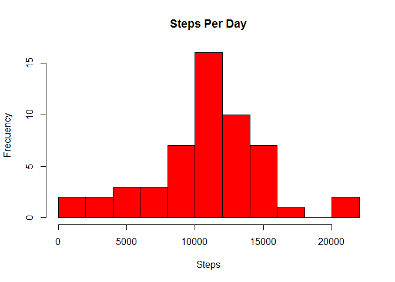
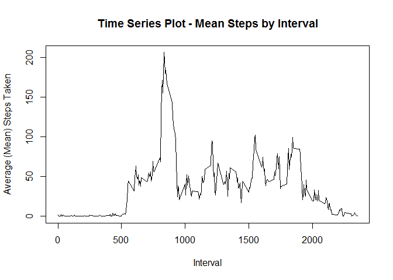
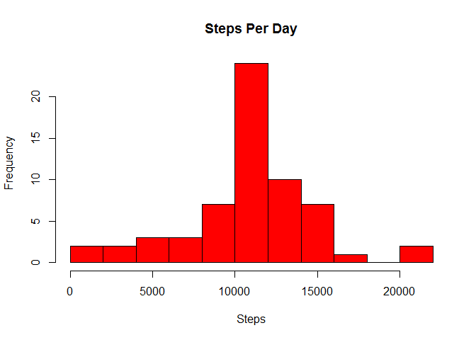
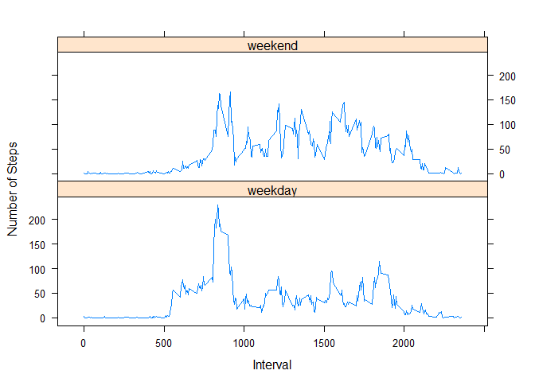

# Reproducible Research: Peer Assessment 1


## Loading and preprocessing the data
First, unzip and load the data - activity.zip must be in the current working directory:

```r
library(lattice)
if (!file.exists("activity.csv")) {
  unzip("activity.zip")
}
data <- read.csv("activity.csv")
```

Now format the dates:

```r
data$date<-as.POSIXct(data$date)
```

## What is mean total number of steps taken per day?

First, make a histogram of the total number of steps taken each day

```r
d.steps <- aggregate(steps ~ date, data, sum, na.rm=TRUE)

hist(d.steps$steps, main="Steps Per Day", breaks=10, xlab="Steps", ylab="Frequency", col="red")
```

 


Now calculate and report the mean and median total number of steps taken per day:

```r
d.mean   <- mean(d.steps$steps)
d.mean
```

```
## [1] 10766.19
```

```r
d.median <- median(d.steps$steps)
d.median
```

```
## [1] 10765
```
The Mean is 10766.19 and the Median is 10765.00.


## What is the average daily activity pattern?

Now we find the average (mean) number of steps by interval:

```r
d.mean.steps <- aggregate(steps ~ interval, data, mean, na.rm=TRUE)
```

Plot the data:

```r
plot(d.mean.steps$interval, d.mean.steps$steps, type="l", xlab="Interval", 
     ylab="Average (Mean) Steps Taken", main="Time Series Plot - Mean Steps by Interval")
```

 

Determine which interval has the maximum number of steps:

```r
d.max.loc <- which(d.mean.steps$steps == max(d.mean.steps$steps))
d.max.int <- d.mean.steps[d.max.loc, 1]
d.max.int
```

```
## [1] 835
```

The maximum number of steps occured at interval 835.


## Imputing missing values

Find the number of missing values:

```r
d.missing <- sum(is.na(data$steps))
d.missing
```

```
## [1] 2304
```

There are 2304 missing values.

Fill in all missing values with the mean value for that interval in a new dataset. 

```r
## Copy dataset
d.new <- data

## Get list of intervals for missing step data  
i <- d.new$interval[which(is.na(d.new$steps))]

## Lookup the mean for each interval and plug back into the new data set
d.new$steps[which(is.na(d.new$steps))] <- 
           sapply(i,function(x) round(d.mean.steps$steps[which(d.mean.steps$interval == x)]))
```

Check the number of missing values again:


```r
d.missing <- sum(is.na(d.new$steps))
d.missing
```

```
## [1] 0
```

There are now 0 missing values.

Now make a histogram of the total number of steps taken each day with the new dataset

```r
d.new.steps <- aggregate(steps ~ date, d.new, sum, na.rm=TRUE)

hist(d.new.steps$steps, main="Steps Per Day", breaks=10, xlab="Steps", ylab="Frequency", col="red")
```

 

Calculate and report the mean and median total number of steps taken per day on the new data:

```r
d.new.mean   <- mean(d.new.steps$steps)
d.new.mean 
```

```
## [1] 10765.64
```

```r
d.new.median <- median(d.new.steps$steps)
d.new.median
```

```
## [1] 10762
```
The Mean is 10765.64 and the Median is 10762.00 for the new, imputed dataset.

These numbers do differ very slightly from the original values calculated for the mean and median, the mean differs by 0.55, and the median differs by 3.00.

The impact of imputing missing data has virtually no effect on the mean and median, since the previous mean and median were calculated with the missing data removed. Furthermore, the added data was derived from the mean and median. While the averages haven't changed, the total overall steps taken will have increased thanks to the new data.


## Are there differences in activity patterns between weekdays and weekends?

Add a new column in the dataset with two levels - "weekday" and "weekend" indicating whether a given date is a weekday or weekend day:

```r
d.new$day <- (ifelse(weekdays(d.new$date) %in% c("Sunday", "Saturday"), "weekend","weekday"))
```


Make a panel plot containing a time series plot of the 5-minute interval (x-axis) and the average number of steps taken, averaged across all weekday days or weekend days (y-axis):


```r
# Compute the time series
d.agg <- with(d.new, aggregate(steps, by=list(day,interval), mean))

# Rename the columns
names(d.agg) <- c("day", "interval", "mean")

# Plot the data
xyplot(mean ~ interval | day, d.agg, type="l", lwd=1, xlab="Interval",  
       ylab="Number of Steps", layout=c(1,2))
```

 

From the above, it appears people are more active on weekends than weekdays during the day.
